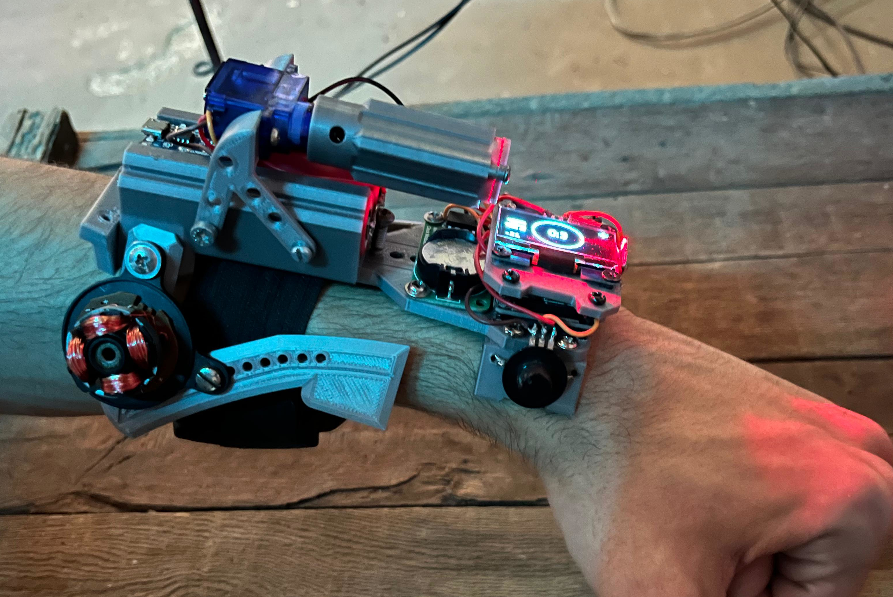
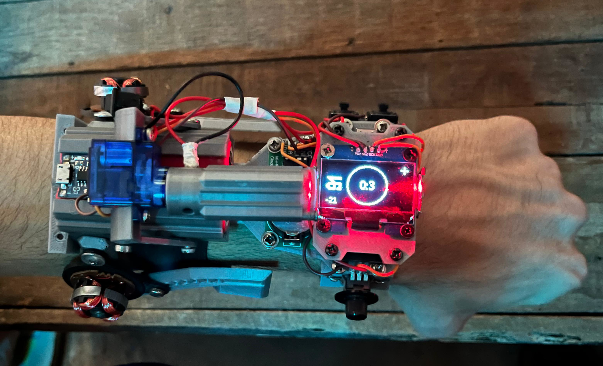
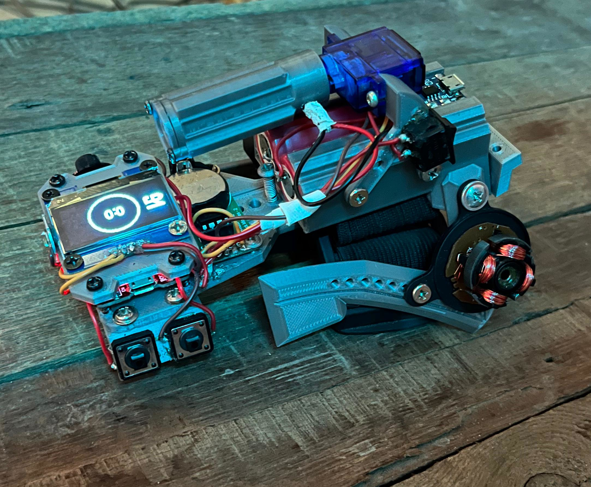
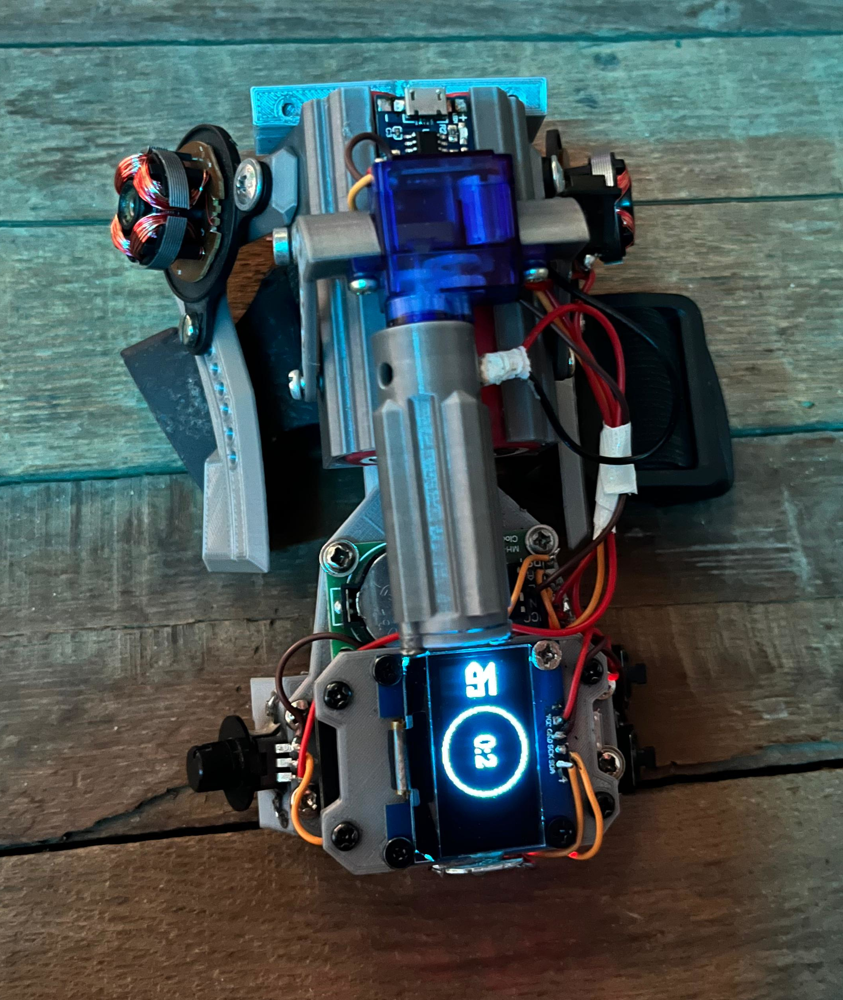

*HAND OF GOD módulo 1*

*Utilidades:*

  Cruz laser rotativa [0°, 180°]
  
  Linterna
  
  Reloj
  
*Sensores:*

  Módulo RTC DS1302
  
  2 x Pulsador 12mmx12mm
  
  Potenciómetro
  
*Actuadores:*

  LED Blanco 5v
  
  Módulo laser 1230 5mW
  
  Servo SG90
  
  Pantalla OLED 1.3p 128x64
  
*Adicional:*

  ESP32
  
  2 x Batería Li-ion 3.7v 1500mAh (Paralelo)
  
  Módulo de carga TP4056
  

